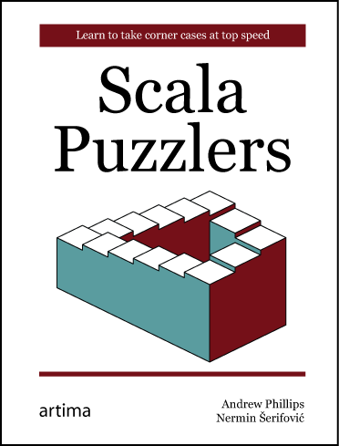

# Scala Puzzlers Reloaded

!SLIDE intro
##Laugh, Then Learn:

##Returns!
Andrew Phillips & Nermin Serifovic

[@ScalaPuzzlers](http://twitter.com/ScalaPuzzlers) 

!SLIDE left top

# First Things First

##Thanks!


Slides prepared using **replhtml** 
from @retronym: https://gist.github.com/retronym/5520762

!SLIDE left top
# Shameless Plug
<div alight="center">


scalapuzzlers.com/buy-the-book


!SLIDE left top

# What is a Puzzler?
 * It has to cover an intentional language feature 

!SLIDE left top
# What is a Puzzler?

 * It has to cover an intentional language feature
   - So no bugs

!SLIDE left top
# What is a Puzzler?

 * It has to cover an intentional language feature
   - So no bugs
 * Not just weird because you don't know Scala

!SLIDE left top
# What is a Puzzler?

 * It has to cover an intentional language feature
   - So no bugs
 * Not just weird because you don't know Scala
   - So no "what is this weird operator?!?"

!SLIDE left top
# What is a Puzzler?

 * It has to cover an intentional language feature
   - So no bugs
 * Not just weird because you don't know Scala
   - So no "what is this weird operator?!?"
 * Should be "surprising" or "non-intuitive" to <br/>a reasonably skilled Scala developer

!SLIDE left top
# What is a Puzzler?

 * It has to cover an intentional language feature
   - So no bugs
 * Not just weird because you don't know Scala
   - So no "what is this weird operator?!?"
 * Should be "surprising" or "non-intuitive" to <br/>a reasonably skilled Scala developer
   - For suitable definitions of <br/>"reasonably skilled" :-)


!SLIDE left top
# It'll be More Fun if...


!SLIDE left top
# Buckle Up


 

 
   

!SLIDE left top

# Stringy Conversions
``` text/x-scala
class A {
  implicit val stringToInt = (_: String).toInt
  println("4" - 2)
}

class B {
  implicit val stringToInt: String => Int = _.toInt
  println("4" - 2)
}

new A()
new B()
```
  
  
!SLIDE left top

# Stringy Conversions
``` text/x-scala
class A {
  implicit val stringToInt = (_: String).toInt
  println("4" - 2)
}

class B {
  implicit val stringToInt: String => Int = _.toInt
  println("4" - 2)
}

new A()
new B()
```

1. Prints:<br/>
`2`<br/>
`2`
2. The first statement prints: `2`<br/> 
and the second throws a runtime exception
3. The first statement fails to compile<br/> 
and the second prints: `2`
4. The first statement fails to compile<br/> 
and the second throws a runtime exception

!SLIDE left top

# Stringy Conversions
``` text/x-scala
class A {
  implicit val stringToInt = (_: String).toInt
  println("4" - 2)
}

class B {
  implicit val stringToInt: String => Int = _.toInt
  println("4" - 2)
}

new A()
new B()
```

Answer #2:<br/>
The first statement prints: `2`<br/> 
and the second throws a runtime exception

Since type of `stringToInt` in `B` is known upfront,<br/>
it is selected to perform the conversion,<br/>
causing an infinite loop

Miles Sabin: "Don't do this!"

!SLIDE left top

# Size It Up
``` text/x-scala
import collection.mutable

def howManyItems(lunchbox: mutable.Set[String], 
                 itemToAdd: String): Int =
  (lunchbox + itemToAdd).size
  
def howManyItemsRefac(lunchbox: mutable.Iterable[String], 
                      itemToAdd: String): Int = 
  (lunchbox + itemToAdd).size

val lunchbox = mutable.Set("chocolate", "juice", "sandwich")

println(howManyItems(lunchbox, "apple"))
println(howManyItemsRefac(lunchbox, "apple"))
println(lunchbox.size)
```
  
!SLIDE left top

# Size It Up
``` text/x-scala
import collection.mutable

def howManyItems(lunchbox: mutable.Set[String], 
                 itemToAdd: String): Int =
  (lunchbox + itemToAdd).size
  
def howManyItemsRefac(lunchbox: mutable.Iterable[String], 
                      itemToAdd: String): Int = 
  (lunchbox + itemToAdd).size

val lunchbox = mutable.Set("chocolate", "juice", "sandwich")

println(howManyItems(lunchbox, "apple"))
println(howManyItemsRefac(lunchbox, "apple"))
println(lunchbox.size)
```
<table>
	<tr>
		<td style="padding:10px 155px;">
			1. Prints:<br/>
			<code>4<br/>5<br/>5</br/></code>
		</td>
		<td style="padding:10px 155px;">
			2. Prints:<br/>
			<code>4<br/>4<br/>3</br/></code>		
		</td>
	</tr>
	<tr>
		<td style="padding:10px 155px;">
			3. Prints:<br/>
			<code>4<br/>4<br/>4</br/></code>		
		</td>
		<td style="padding:10px 155px;">
			4. Prints:<br/>
			<code>4<br/>43<br/>3</br/></code>		
		</td>
	</tr>
</table>


!SLIDE left top

# Size It Up
``` text/x-scala
import collection.mutable

def howManyItems(lunchbox: mutable.Set[String], 
                 itemToAdd: String): Int =
  (lunchbox + itemToAdd).size
  
def howManyItemsRefac(lunchbox: mutable.Iterable[String], 
                      itemToAdd: String): Int = 
  (lunchbox + itemToAdd).size

val lunchbox = mutable.Set("chocolate", "juice", "sandwich")

println(howManyItems(lunchbox, "apple"))
println(howManyItemsRefac(lunchbox, "apple"))
println(lunchbox.size)
```

Answer #4:<br/>
<code>4<br/>43<br/>3</br/></code>	

`+` is defined for `Set`, but not for `Iterable`

So, the second `+` represents `String` concatentation<br/>
and this applies because of the existence of the evil `any2stringadd`

!SLIDE left top

# One, Two, Skip a Few
``` text/x-scala
val oneTwo = Seq(1, 2).permutations

if (oneTwo.length > 0) {
  println("Permutations of 1 and 2:")
  oneTwo foreach println
}

val threeFour = Seq(3, 4).permutations

if (!threeFour.isEmpty) {
  println("Permutations of 3 and 4:")
  threeFour foreach println
}
```
  
!SLIDE left top

# One, Two, Skip a Few
``` text/x-scala
val oneTwo = Seq(1, 2).permutations

if (oneTwo.length > 0) {
  println("Permutations of 1 and 2:")
  oneTwo foreach println
}

val threeFour = Seq(3, 4).permutations

if (!threeFour.isEmpty) {
  println("Permutations of 3 and 4:")
  threeFour foreach println
}
```

<table>
	<tr>
		<td>
			1. Prints:<br/>
			Permutations of 1 and 2:<br/>
			<code>List(1, 2)</code><br/>
			<code>List(2, 1)</code><br/>
			Permutations of 3 and 4:<br/>
			<code>List(3, 4)</code><br/>
			<code>List(4, 3)</code>
		</td>
		<td>
			2. Prints:<br/>
			Permutations of 1 and 2:<br/>
			<code>List(1, 2)</code><br/>
			Permutations of 3 and 4:<br/>
			<code>List(3, 4)</code>
		</td>
	</tr>
	<tr>
		<td>
			3. Prints:<br/>
			Permutations of 1 and 2:<br/>
			<code>List(1, 2)</code><br/>
			<code>List(2, 1)</code>	
		</td>
		<td>
			4. Prints:<br/>
			Permutations of 1 and 2:<br/>
			Permutations of 3 and 4:<br/>
			<code>List(3, 4)</code><br/>
			<code>List(4, 3)</code>
		</td>
	</tr>
</table>

!SLIDE left top

# One, Two, Skip a Few
``` text/x-scala
val oneTwo = Seq(1, 2).permutations

if (oneTwo.length > 0) {
  println("Permutations of 1 and 2:")
  oneTwo foreach println
}

val threeFour = Seq(3, 4).permutations

if (!threeFour.isEmpty) {
  println("Permutations of 3 and 4:")
  threeFour foreach println
}
```

Answer #4:<br/>
Permutations of 1 and 2:<br/>
Permutations of 3 and 4:<br/>
<code>List(3, 4)</code><br/>
<code>List(4, 3)</code>

`permutations` returns an `Iterator`

Never call any methods except `next` and `hasNext` on an iterator<br/>
after calling a method on it.

!SLIDE left top

# A Listful of Dollars
``` text/x-scala
type Dollar = Int
final val Dollar: Dollar = 1
val a: List[Dollar] = List(1, 2, 3)

println(a map { a: Int => Dollar })
println(a.map(a: Int => Dollar))
```
  
!SLIDE left top

# A Listful of Dollars
``` text/x-scala
type Dollar = Int
final val Dollar: Dollar = 1
val a: List[Dollar] = List(1, 2, 3)

println(a map { a: Int => Dollar })
println(a.map(a: Int => Dollar))
```

<table>
	<tr>
		<td>
			1. Prints:<br/>
			<code>
			List(1, 2, 3)<br/>
			List(1, 2, 3)
			</code>			
		</td>
		<td>
			2. The first one prints:<br/>
			<code>List(1, 1, 1)</code><br/>
			and the second one throws<br/> a runtime exception
		</td>
	</tr>
	<tr>
		<td>
			3. Prints:<br/>
			<code>
			List(1, 1, 1)<br/>
			List(1, 1, 1)
			</code>
		</td>
		<td>
			4. The first one prints:<br/>
			<code>List(1, 2, 3)</code><br/>
			and the second one fails<br/> to compile
		</td>
	</tr>
</table>


!SLIDE left top

# A Listful of Dollars
``` text/x-scala
type Dollar = Int
final val Dollar: Dollar = 1
val a: List[Dollar] = List(1, 2, 3)

println(a map { a: Int => Dollar })
println(a.map(a: Int => Dollar))
```

Answer #2:<br/>
The first one prints: <code>List(1, 1, 1)</code><br/>
and the second one throws a runtime exception

`{ a: Int => Dollar }` is parsed as:<br/> `{ (a: Int) => Dollar }`

`(a: Int => Dollar)` is parsed as:<br/> `(a: (Int => Dollar)}`

`List` is a `Function1` and `{ ... }` can enclose a *ResultExpr*,<br/> 
whereas `( ... )` can only enclose an *Expr*. 
A *ResultExpr*, but not an *Expr*, can include a type specification for its argument.

!SLIDE left top

# The Devil Is in the Defaults
``` text/x-scala
import collection.mutable.Queue

val goodies: Map[String, Queue[String]] = 
  Map().withDefault(_ => Queue("Keep looking."))
  
val baddies: Map[String, Queue[String]] = 
  Map().withDefaultValue(Queue("Nothing here."))

println(goodies("kitchen").dequeue)
println(baddies("in attic").dequeue)
println(goodies("dining room").dequeue)
println(baddies("under bed").dequeue)
```
  
!SLIDE left top

# The Devil Is in the Defaults
``` text/x-scala
import collection.mutable.Queue

val goodies: Map[String, Queue[String]] = 
  Map().withDefault(_ => Queue("Keep looking."))
  
val baddies: Map[String, Queue[String]] = 
  Map().withDefaultValue(Queue("Nothing here."))

println(goodies("kitchen").dequeue)
println(baddies("in attic").dequeue)
println(goodies("dining room").dequeue)
println(baddies("under bed").dequeue)
```
<table>
	<tr>
		<td>
			1. First, second & third print:<br/>
			<code>
			Keep looking.<br/>
			Nothing here.<br/>
			Keep looking.<br/>
			</code>
			and the forth throws a runtime exception
		</td>
		<td>
			2. First & second print:<br/>
			<code>
			Keep looking.<br/>
			Nothing here.<br/>
			</code>
			and third & forth throw a runtime exception
		</td>
	</tr>
	<tr>
		<td>
			3. All four throw a runtime exception.
		</td>
		<td>
			4. Prints:<br/>
			<code>
			Keep looking.<br/>
			Nothing here.<br/>
			Keep looking.<br/>
			Nothing here.<br/>
			</code>
		</td>
	</tr>
</table>


!SLIDE left top

# The Devil Is in the Defaults
``` text/x-scala
import collection.mutable.Queue

val goodies: Map[String, Queue[String]] = 
  Map().withDefault(_ => Queue("Keep looking."))
  
val baddies: Map[String, Queue[String]] = 
  Map().withDefaultValue(Queue("Nothing here."))

println(goodies("kitchen").dequeue)
println(baddies("in attic").dequeue)
println(goodies("dining room").dequeue)
println(baddies("under bed").dequeue)
```

Answer #1:<br/>
First, second & third print:<br/>
<code>
Keep looking.<br/>
Nothing here.<br/>
Keep looking.<br/>
</code>
and the forth throws a runtime exception

The value provided for `withDefaultValue`<br/>
is shared across all map entries.

!SLIDE left top

# Return to Me!
``` text/x-scala
def value: Int = {
  def one(x: Int): Int = { return x; 1 }
  val two = (x: Int) => { return x; 2 }
  1 + one(2) + two(3)
}

println(value)
```
  
!SLIDE left top

# Return to Me!
``` text/x-scala
def value: Int = {
  def one(x: Int): Int = { return x; 1 }
  val two = (x: Int) => { return x; 2 }
  1 + one(2) + two(3)
}

println(value)
```

1. Prints: `3`
2. Prints: `4`
3. Prints: `6`
4. Fails with a compilation error: unreachable code


!SLIDE left top

# Return to Me!
``` text/x-scala
def value: Int = {
  def one(x: Int): Int = { return x; 1 }
  val two = (x: Int) => { return x; 2 }
  1 + one(2) + two(3)
}

println(value)
```

Answer #1:<br/> 
Prints `3`

`return` statement returns from enclosing `def`<br/>
and function values do not qualify as an enclosing function.

!SLIDE left top

# Set the Record Straight
``` text/x-scala
val numbers = List("1", "2").toSet() + "3"

println(numbers)
```
  
!SLIDE left top

# Set the Record Straight
``` text/x-scala
val numbers = List("1", "2").toSet() + "3"

println(numbers)
```

1. Prints: `Set(1, 2, 3)`
2. Fails with a compilation error
3. Prints: `false3`
4. Prints: `123`

!SLIDE left top

# Set the Record Straight
``` text/x-scala
val numbers = List("1", "2").toSet() + "3"

println(numbers)
```

Answer #3:<br/>
Prints: `false3`

`toSet` method is parameterless

empty argument list is adapted to `(): Unit`<br/>
and is passed to the apply method on the resulting set,<br/> 
which tests for inclusion of an item in the set.<br/> 
This is likely to "go away" in future versions.

!SLIDE left top

# What's in a Name?
``` text/x-scala
class C {
  def sum(x: Int = 1, y: Int = 2): Int = x + y
}

class D extends C {
  override def sum(y: Int = 3, x: Int = 4): Int = super.sum(x, y)
}

val d: D = new D
val c: C = d
println(c.sum(x = 0))
println(d.sum(x = 0))
```
  
!SLIDE left top

# What's in a Name?
``` text/x-scala
class C {
  def sum(x: Int = 1, y: Int = 2): Int = x + y
}

class D extends C {
  override def sum(y: Int = 3, x: Int = 4): Int = super.sum(x, y)
}

val d: D = new D
val c: C = d
println(c.sum(x = 0))
println(d.sum(x = 0))
```

<table>
  <tr>
    <td style="padding:10px 155px;">
		1. Prints:<br/>
		<code>
			2<br/>
			3<br/>	
		</code>	
  	</td>
	<td style="padding:10px 155px;">
		2. Prints:<br/>
		<code>
			1<br/>
			3<br/>	
		</code>	
	</td>
  </tr>
  <tr>
	<td style="padding:10px 155px;">
		3. Prints:<br/>
		<code>
			4<br/>
			3<br/>	
		</code>	
	</td>
	<td style="padding:10px 155px;">
		4. Prints:<br/>
		<code>
			3<br/>
			3<br/>	
		</code>	
	</td>
  </tr>
</table>

!SLIDE left top

# What's in a Name?
``` text/x-scala
class C {
  def sum(x: Int = 1, y: Int = 2): Int = x + y
}

class D extends C {
  override def sum(y: Int = 3, x: Int = 4): Int = super.sum(x, y)
}

val d: D = new D
val c: C = d
println(c.sum(x = 0))
println(d.sum(x = 0))
```

Answer #3:<br/>
Prints:<br/>
<code>
4<br/>
3<br/>	
</code>

As Josh Suereth summarizes:<br/> **Names are static; values are runtime.**

!SLIDE left top
# Thanks! 

## Any questions?


