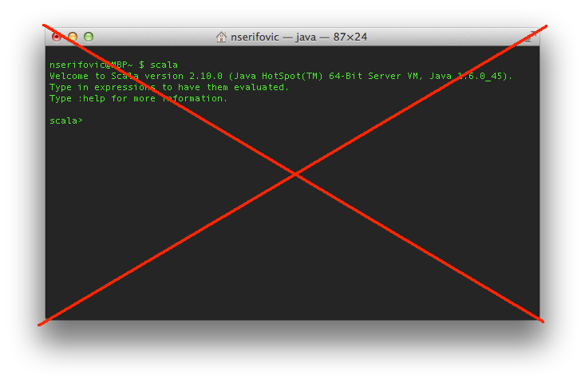

# Scala Puzzlers Reloaded

!SLIDE intro

Andrew Phillips & Nermin Serifovic

[@ScalaPuzzlers](http://twitter.com/ScalaPuzzlers) 

!SLIDE left top

# First Things First

##Thanks!


!SLIDE left top

# What is a Puzzler?
 * It has to cover an intentional language feature

!SLIDE left top
# What is a Puzzler?

 * It has to cover an intentional language feature
   - So no bugs

!SLIDE left top
# What is a Puzzler?

 * It has to cover an intentional language feature
   - So no bugs
 * Not just weird because you don't know Scala

!SLIDE left top
# What is a Puzzler?

 * It has to cover an intentional language feature
   - So no bugs
 * Not just weird because you don't know Scala
   - So no "what is this weird operator?!?"

!SLIDE left top
# What is a Puzzler?

 * It has to cover an intentional language feature
   - So no bugs
 * Not just weird because you don't know Scala
   - So no "what is this weird operator?!?"
 * Should be "surprising" or "non-intuitive" to <br/>a reasonably skilled Scala developer

!SLIDE left top
# What is a Puzzler?

 * It has to cover an intentional language feature
   - So no bugs
 * Not just weird because you don't know Scala
   - So no "what is this weird operator?!?"
 * Should be "surprising" or "non-intuitive" to <br/>a reasonably skilled Scala developer
   - For suitable definitions of <br/>"reasonably skilled" :-)


!SLIDE left top
# Scala Version


!SLIDE left top
# It'll be More Fun if...


!SLIDE left top
# Buckle Up


 

 
   

!SLIDE left top

# A Case of Strings
``` text/x-scala
def objFromJava: Object = "string"
def stringFromJava: String = null

def printLengthIfString(a: AnyRef) {
  a match {
    case s: String => println("String of length " + s.length)
    case _ => println("Not a string")
  }
}

printLengthIfString(objFromJava)
printLengthIfString(stringFromJava)
```
  
  
!SLIDE left top

# A Case of Strings
``` text/x-scala
def objFromJava: Object = "string"
def stringFromJava: String = null

def printLengthIfString(a: AnyRef) {
  a match {
    case s: String => println("String of length " + s.length)
    case _ => println("Not a string")
  }
}

printLengthIfString(objFromJava)
printLengthIfString(stringFromJava)
```

1. Prints:<br/>
`Not a string`<br/>
`String of length 0`
2. The first prints: `Not a string`<br/> 
and the second fails with a `NullPointerException`
3. Prints:<br/>
`String of length 6`<br/>
`Not a string`
4. The first prints: `String of length 6`<br/> 
and the second fails with a `NullPointerException`

!SLIDE left top

# A Case of Strings
``` text/x-scala
def objFromJava: Object = "string"
def stringFromJava: String = null

def printLengthIfString(a: AnyRef) {
  a match {
    case s: String => println("String of length " + s.length)
    case _ => println("Not a string")
  }
}

printLengthIfString(objFromJava)
printLengthIfString(stringFromJava)
```

Prints:<br/>
`String of length 6`<br/>
`Not a string`

*null* is not an instance of String (inherited from Java)

Must explicitly check for *nulls*.

What is a better way to handle *nulls*?

!SLIDE left top

# All's Well That Folds Well
``` text/x-scala
val ints = List(1, 2, 3)
val accumulator: List[Int] = Nil

val leftReversed = (ints foldLeft accumulator) { (acc, elem) => elem :: acc }
val rightReversed = (ints foldRight accumulator) { (elem, acc) => acc :+ elem }
println(leftReversed)
println(rightReversed)

// ...and back
println((leftReversed /: accumulator) { (acc, elem) => elem :: acc })
println((rightReversed :\ accumulator) { (elem, acc) => acc :+ elem })

```
  
!SLIDE left top

# All's Well That Folds Well
``` text/x-scala
val ints = List(1, 2, 3)
val accumulator: List[Int] = Nil

val leftReversed = (ints foldLeft accumulator) { (acc, elem) => elem :: acc }
val rightReversed = (ints foldRight accumulator) { (elem, acc) => acc :+ elem }
println(leftReversed)
println(rightReversed)

// ...and back
println((leftReversed /: accumulator) { (acc, elem) => elem :: acc })
println((rightReversed :\ accumulator) { (elem, acc) => acc :+ elem })
```
<table>
	<tr>
		<td>
			1. Prints:<br/>
			<code>List(3, 2, 1)<br/>List(3, 2, 1)</code><br/>
			<code>List(1, 2, 3)<br/>List(1, 2, 3)</code>
		</td>
		<td>
			2. Prints:<br/>
			<code>List(3, 2, 1)<br/>List(3, 2, 1)</code><br/>
			<code>List(3, 2, 1)<br/>List(3, 2, 1)</code>
		</td>
	</tr>
	<tr>
		<td>
			3. Prints:<br/>
			<code>List(3, 2, 1)<br/>List(1, 2, 3)</code><br/>
			<code>List(1, 2, 3)<br/>List(3, 2, 1)</code>
		</td>
		<td>
			4. Prints:<br/>
			<code>List(3, 2, 1)<br/>List(3, 2, 1)</code><br/>
			<code>List(3, 2, 1)<br/>List(1, 2, 3)</code>
		</td>
	</tr>
</table>


!SLIDE left top

# All's Well That Folds Well
``` text/x-scala
val ints = List(1, 2, 3)
val accumulator: List[Int] = Nil

val leftReversed = (ints foldLeft accumulator) { (acc, elem) => elem :: acc }
val rightReversed = (ints foldRight accumulator) { (elem, acc) => acc :+ elem }
println(leftReversed)
println(rightReversed)

// ...and back
println((leftReversed /: accumulator) { (acc, elem) => elem :: acc })
println((rightReversed :\ accumulator) { (elem, acc) => acc :+ elem })
```

Prints:<br/>
<code>List(3, 2, 1)<br/>List(3, 2, 1)</code><br/>
<code>List(3, 2, 1)<br/>List(1, 2, 3)</code>

Operators ending in *:* are right associative

!SLIDE left top

# Type Extortion
``` text/x-scala
val (x, y) = (List(1,3,5), List(2,4,6)).zipped find (_._1 > 10) getOrElse (10)
println(s"Found $x")
```
  
!SLIDE left top

# Type Extortion
``` text/x-scala
val (x, y) = (List(1,3,5), List(2,4,6)).zipped find (_._1 > 10) getOrElse (10)
println(s"Found $x")
```

1. Prints:<br/>
`Found 10`
2. Prints:<br/>
`Found ()`
3. Fails with a compilation exception
4. Fails with a runtime exception


!SLIDE left top

# Type Extortion
``` text/x-scala
val (x, y) = (List(1,3,5), List(2,4,6)).zipped find (_._1 > 10) getOrElse (10)
println(s"Found $x")
```

Fails with a runtime exception

*Option.orElse* accepts a wider type, including *Any*

`def getOrElse[B >: A](default: => B): B`

!SLIDE left top

# Pick an Int, Any Int!
``` text/x-scala
class A {
  type X // X <: Any 
  var x: X = _
}

class B extends A {
  type X = Int
}

val b = new B
println(b.x)

val bX = b.x
println(bX)
```
  
!SLIDE left top

# Pick an Int, Any Int!
``` text/x-scala
class A {
  type X // X <: Any 
  var x: X = _
}

class B extends A {
  type X = Int
}

val b = new B
println(b.x)

val bX = b.x
println(bX)
```

<table>
	<tr>
		<td>
			1. The first fails at runtime<br/> with a <code>NullPointerException</code>,<br>
			the second prints: <code>0</code>
		</td>
		<td>
			2. Prints:<br/>
			<code>0</code><br/>
			<code>0</code>
		</td>
	</tr>
	<tr>
		<td>
			3. Prints:<br/>
			<code>&lt;lazy&gt;</code><br/>
			<code>null</code>
		</td>
		<td>
			4. Prints:<br/>
			<code>null</code><br/>
			<code>0</code>
		</td>
	</tr>
</table>


!SLIDE left top

# Pick an Int, Any Int!
``` text/x-scala
class A {
  type X // X <: Any 
  var x: X = _
}

class B extends A {
  type X = Int
}

val b = new B
println(b.x)

val bX = b.x
println(bX)
```

Prints:<br/>
`null`<br/>
`0`

Field x is uninitialized and *println* takes *Any* as a parameter,<br/> so unboxing does not happen.

!SLIDE left top

# Cast Away
``` text/x-scala
import scala.collection.JavaConverters._

def fromJava: java.util.Map[String, java.lang.Integer] = {
  val map = new java.util.HashMap[String, java.lang.Integer]()
  map.put("key", null)
  map
}

val map = fromJava.asScala.asInstanceOf[scala.collection.Map[String, Int]]

println(map("key") == null)
println(map("key") == 0)
```
  
!SLIDE left top

# Cast Away
``` text/x-scala
import scala.collection.JavaConverters._

def fromJava: java.util.Map[String, java.lang.Integer] = {
  val map = new java.util.HashMap[String, java.lang.Integer]()
  map.put("key", null)
  map
}

val map = fromJava.asScala.asInstanceOf[scala.collection.Map[String, Int]]

println(map("key") == null)
println(map("key") == 0)
```
<table>
	<tr>
		<td>
			1. Prints:<br/>
			<code>true</code><br/>
			<code>true</code>
		</td>
		<td>
			2. Both fail with a <br/><code>NullPointerException</code>
		</td>
	</tr>
	<tr>
		<td>
			3. Prints:<br/>
			<code>true</code><br/>
			<code>false</code>
		</td>
		<td>
			4. Prints:<br/>
			<code>false</code><br/>
			<code>true</code>
		</td>
	</tr>
</table>


!SLIDE left top

# Cast Away
``` text/x-scala
import scala.collection.JavaConverters._

def fromJava: java.util.Map[String, java.lang.Integer] = {
  val map = new java.util.HashMap[String, java.lang.Integer]()
  map.put("key", null)
  map
}

val map = fromJava.asScala.asInstanceOf[scala.collection.Map[String, Int]]

println(map("key") == null)
println(map("key") == 0)
```

Prints:<br/>
`true`<br/>
`true`

*java.lang.Integer* and *scala.Int* are not *quite* the same.

`BoxesRunTime.unboxToInt:`

<code>
public static int unboxToInt(Object i) {<br/>
  return i == null ? 0 : ((java.lang.Integer)i).intValue();}
</code>


!SLIDE left top

# I Can Has Padding?
``` text/x-scala
implicit class Padder(val sb: StringBuilder) extends AnyVal {
  def pad2(width: Int) = {
    1 to width - sb.length foreach { sb append '*' }
    sb
  }
}

// greeting.length == 14
val greeting = new StringBuilder("Hello, kitteh!")
println(greeting pad2 20)

// farewell.length == 9
val farewell = new StringBuilder("U go now.")  // I hatez long bye-bye.
println(farewell pad2 20)
```
  
!SLIDE left top

# I Can Has Padding?
``` text/x-scala
implicit class Padder(val sb: StringBuilder) extends AnyVal {
  def pad2(width: Int) = {
    1 to width - sb.length foreach { sb append '*' }
    sb
  }
}

// greeting.length == 14
val greeting = new StringBuilder("Hello, kitteh!")
println(greeting pad2 20)

// farewell.length == 9
val farewell = new StringBuilder("U go now.")  // I hatez long bye-bye.
println(farewell pad2 20)
```

1. Prints:<br/>
<code>Hello, kitteh!&#42;&#42;&#42;&#42;&#42;&#42;</code><br/>
<code>U go now.&#42;&#42;&#42;&#42;&#42;&#42;&#42;&#42;&#42;&#42;&#42;</code>
2. The first one succeeds and prints:
<code>Hello, kitteh!&#42;</code><br/>
and the second one fails with a runtime exception
3. The first one fails with a runtime exception<br/> and the second one prints:
<code>U go now.&#42;&#42;&#42;&#42;&#42;&#42;&#42;&#42;&#42;&#42;&#42;</code>
4. Does not compile

!SLIDE left top

# I Can Has Padding?
``` text/x-scala
implicit class Padder(val sb: StringBuilder) extends AnyVal {
  def pad2(width: Int) = {
    1 to width - sb.length foreach { sb append '*' }
    sb
  }
}

// greeting.length == 14
val greeting = new StringBuilder("Hello, kitteh!")
println(greeting pad2 20)

// farewell.length == 9
val farewell = new StringBuilder("U go now.")  // I hatez long bye-bye.
println(farewell pad2 20)
```

The first one succeeds and prints:<br/>
<code>Hello, kitteh!&#42;</code><br/>
and the second one fails with a runtime exception

Scala has a StringBuilder that shadows *java.lang.StringBuilder* and it has an apply method which is an alias for *StringBuilder.charAt*

!SLIDE left top

# Count Me Now, Count Me Later
``` text/x-scala
var x = 0
def counter = { x += 1; x }
def add(a: Int)(b: Int) = a + b
val adder1 = add(counter)(_)
val adder2 = add(counter) _

println("x = " + x + ", a1= " + adder1(10))
println("x = " + x + ", a2= " + adder2(10))
println("x = " + x)
```
  
!SLIDE left top

# Count Me Now, Count Me Later
``` text/x-scala
var x = 0
def counter = { x += 1; x }
def add(a: Int)(b: Int) = a + b
val adder1 = add(counter)(_)
val adder2 = add(counter) _

println("x = " + x + ", a1= " + adder1(10))
println("x = " + x + ", a2= " + adder2(10))
println("x = " + x)
```
<table>
	<tr>
		<td>
			1. Prints: <br/>
			<code>x = 1, a1 = 12</code><br/>
			<code>x = 2, a2 = 11</code><br/>
			<code>x = 2</code>
		</td>
		<td>
			2. Prints: <br/>
			<code>x = 1, a1 = 11</code><br/>
			<code>x = 1, a2 = 12</code><br/>
			<code>x = 2</code>
		</td>
	</tr>
	<tr>
		<td>
			3. Prints: <br/>
			<code>x = 0, a1 = 11</code><br/>
			<code>x = 1, a2 = 12</code><br/>
			<code>x = 2</code>		
		</td>
		<td>
			4. Prints: <br/>
			<code>x = 2, a1 = 11</code><br/>
			<code>x = 2, a2 = 12</code><br/>
			<code>x = 2</code>
		</td>
	</tr>
</table>

!SLIDE left top

# Count Me Now, Count Me Later
``` text/x-scala
var x = 0
def counter = { x += 1; x }
def add(a: Int)(b: Int) = a + b
val adder1 = add(counter)(_)
val adder2 = add(counter) _

println("x = " + x + ", a1= " + adder1(10))
println("x = " + x + ", a2= " + adder2(10))
println("x = " + x)
```

Prints: <br/>
<code>x = 1, a1 = 12</code><br/>
<code>x = 2, a2 = 11</code><br/>
<code>x = 2</code>

These two *adders* have different semantics<br/> as to when the arguments get evaluated.

!SLIDE left top

# The Trouble With Traits 2
``` text/x-scala
trait A {
  val foo: Int
  val bar = 10
  println("In A: foo: " + foo + ", bar: " + bar)
}

class B extends A {
  val foo: Int = 25
  println("In B: foo: " + foo + ", bar: " + bar)
}

class C extends B {
  override val bar = 99
  println("In C: foo: " + foo + ", bar: " + bar)
}

new C
```
  
!SLIDE left top

# The Trouble With Traits 2
``` text/x-scala
trait A {
  val foo: Int
  val bar = 10
  println("In A: foo: " + foo + ", bar: " + bar)
}

class B extends A {
  val foo: Int = 25
  println("In B: foo: " + foo + ", bar: " + bar)
}

class C extends B {
  override val bar = 99
  println("In C: foo: " + foo + ", bar: " + bar)
}

new C
```
<table>
	<tr>
		<td>
			1. Prints:<br/>
			<code>In A: foo: 0, bar: 0</code><br/>
			<code>In B: foo: 25, bar: 0</code><br/>
			<code>In C: foo: 25, bar: 99
		</td>
		<td>
			2. Prints:<br/>
			<code>In A: foo: 0, bar: 10</code><br/>
			<code>In B: foo: 25, bar: 10</code><br/>
			<code>In C: foo: 25, bar: 99</code>
		</td>
	</tr>
	<tr>
		<td>
			3. Prints:<br/>
			<code>In A: foo: 0, bar: 0</code><br/>
			<code>In B: foo: 25, bar: 99</code><br/>
			<code>In C: foo: 25, bar: 99</code>		
		</td>
		<td>
			4. Prints:<br/>
			<code>In A: foo: 25, bar: 99</code><br/>
			<code>In B: foo: 25, bar: 99</code><br/>
			<code>In C: foo: 25, bar: 99</code>
		</td>
	</tr>
</table>

!SLIDE left top

# The Trouble With Traits 2
``` text/x-scala
trait A {
  val foo: Int
  val bar = 10
  println("In A: foo: " + foo + ", bar: " + bar)
}

class B extends A {
  val foo: Int = 25
  println("In B: foo: " + foo + ", bar: " + bar)
}

class C extends B {
  override val bar = 99
  println("In C: foo: " + foo + ", bar: " + bar)
}

new C
```

Prints:<br/>
`In A: foo: 0, bar: 0`<br/>
`In B: foo: 25, bar: 0`<br/>
`In C: foo: 25, bar: 99`

The Scala compiler will only initialize vals once


!SLIDE left top
# Thanks! 

## Any questions?

Slides prepared using replhtml from @retronym: https://gist.github.com/retronym/5520762


